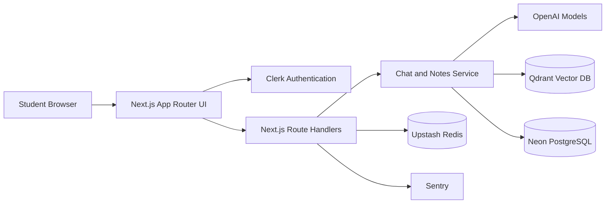
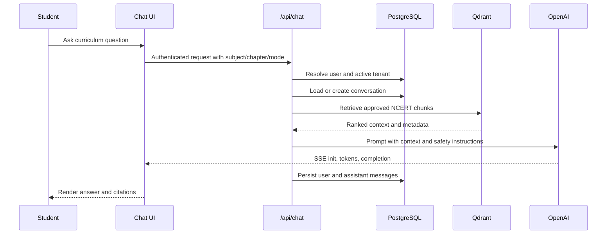
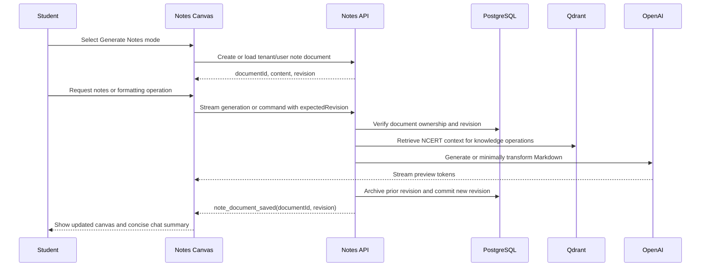
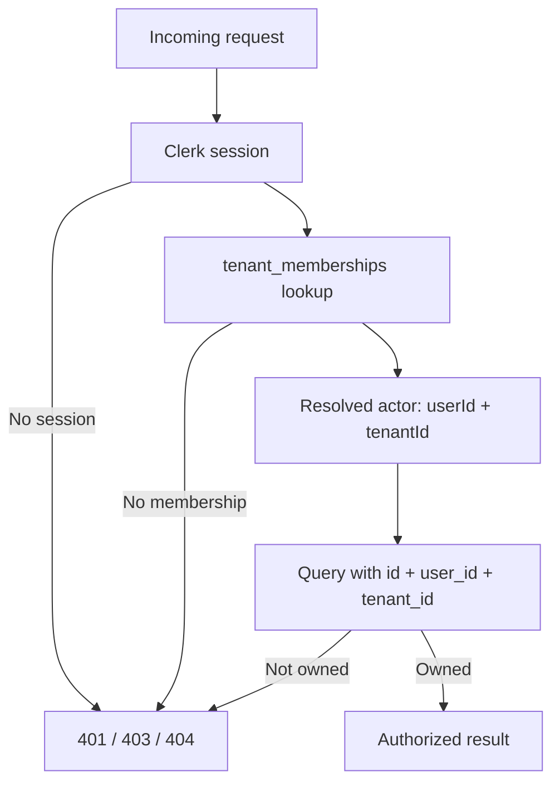
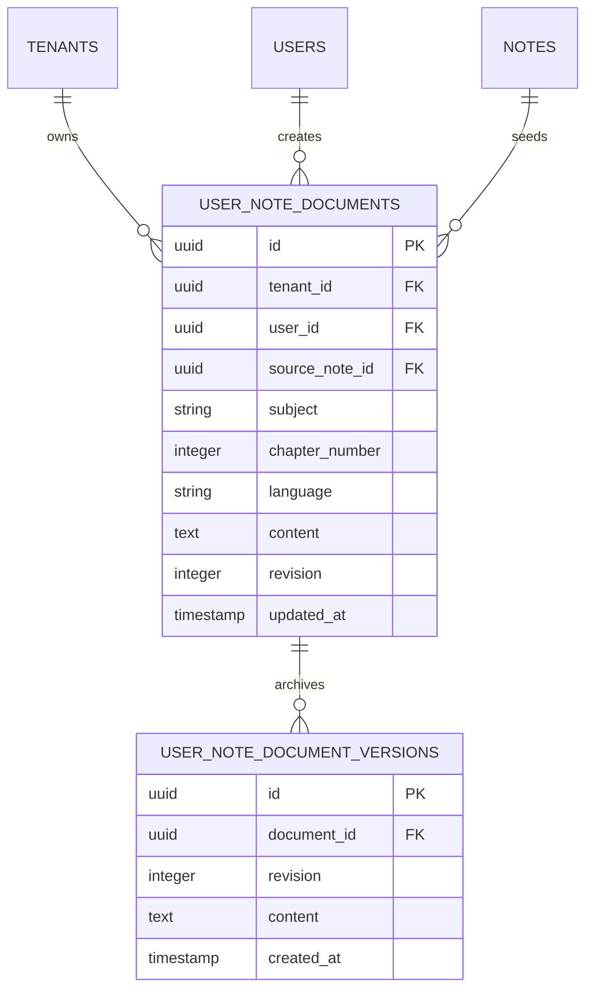

# StudyNotes+

StudyNotes+ is an AI-powered CBSE Class 10 study assistant for Mathematics and Science. It combines NCERT-grounded chat, step-by-step problem solving, interactive note generation, safe note editing, Markdown/LaTeX rendering, and student-owned revision history.

The application is designed for Indian students and uses a tenant-aware data model so a student's notes and conversations remain isolated within the active workspace.

## Demo Video

A 3-minute walkthrough of StudyNotes+ — NCERT-grounded chat, the side-by-side notes canvas, and safe AI editing:

<video src="/walkthrough.mp4" controls width="100%"></video>


## Product Capabilities

- NCERT-grounded explanations and problem solving for Class 10 Mathematics and Science.
- Generate Notes mode with a persistent, editable notes canvas. On desktop (>= `lg`) the chat and canvas render side by side, each taking half the content width beside the sidebar; below `lg` the canvas overlays the chat as a full-screen panel.
- Concise, per-message chat summaries for note operations (the streaming bubble is finalized to a short status on save, so raw notes markdown is never leaked into the chat pane).
- AI commands for formatting headings, bullets, formulas, key points, highlights, and structure.
- Manual Markdown editing with toolbar actions for headings, emphasis, bullets, and highlights.
- LaTeX rendering through KaTeX.
- Source citations for retrieved curriculum content.
- Optimistic concurrency, revision history, Undo, conflict handling, and cancellation-safe AI edits.
- Clerk authentication, tenant membership checks, parental consent flow, rate limiting, moderation, logging, and Sentry integration.
- Markdown and styled PDF export.

## Technology Stack

| Area | Technology |
| --- | --- |
| Web application | Next.js 16 App Router, React 19, TypeScript |
| Styling | Tailwind CSS 4, custom CSS, Motion |
| Authentication | Clerk |
| Language models | OpenAI chat, reasoning, embeddings, and moderation models |
| Retrieval | Qdrant vector database with OpenAI embeddings |
| Database | Neon PostgreSQL |
| Rate limiting | Upstash Redis REST API |
| Rendering | Streamdown, KaTeX, Markdown, safe custom highlight rendering |
| Observability | Structured logger, database events, Sentry |
| Deployment | Vercel-compatible Next.js deployment |

## Architecture

### High-Level Design



### Retrieval-Augmented Chat



### Interactive Notes Flow



## Low-Level Design

### Request and Ownership Boundary

Every authenticated request that touches private study data follows this boundary:



### Note Document Model

`notes` contains global curated or generated source notes. It must not contain student edits. Student work is stored separately:



The uniqueness boundary is `(tenant_id, user_id, subject, chapter_number, language)`: one active document per student and chapter in each workspace.

### Notes API Contract

| Endpoint | Responsibility |
| --- | --- |
| `POST /api/note-documents` | Create or load the empty/private document for the active tenant and student. |
| `GET /api/note-documents/:id` | Load a document after ownership verification. |
| `PATCH /api/note-documents/:id` | Save manual Markdown using `expectedRevision`. Returns `409` on conflict. |
| `POST /api/note-documents/:id/commands` | Apply a server-authoritative AI edit and stream the result. |
| `POST /api/note-documents/:id/undo` | Restore the previous archived revision as a new revision. |
| `GET/POST /api/notes` | Retired; returns `410 Gone` to prevent shared-note corruption. |

Successful streamed note operations emit:

```json
{
  "type": "note_document_saved",
  "documentId": "uuid",
  "revision": 5,
  "operation": "generate",
  "citations": []
}
```

The transport-level `done` event only means the HTTP stream ended. The client treats a revision as saved only after `note_document_saved`.

### Notes Safety Rules

- Transform commands such as highlighting, reordering, and formatting do not need retrieval.
- Knowledge commands such as adding definitions, examples, derivations, or exam questions retrieve approved NCERT context.
- The model must preserve unrelated content and apply the smallest requested change.
- Note documents are limited to 24,000 characters and instructions to 1,000 characters.
- Inputs and streamed outputs are moderated.
- AI output is previewed without replacing the saved document until commit succeeds.
- Revision checks prevent concurrent manual edits or AI streams from overwriting newer work.
- Markdown highlights use a fixed safe class allowlist; arbitrary HTML and inline styles are not accepted.

## Project Structure

```text
app/
  api/                         Route handlers, auth, validation, SSE
  chat/                        Main chat and notes workspace UI
  globals.css                  Application and print styles
components/
  NotesCanvas.tsx              Controlled notes editor, renderer, export UI
hooks/
  useChat.ts                   Chat state and SSE event handling
  useStream.ts                 Fetch-based SSE reader and cancellation
lib/
  notes/                      Server-only source retrieval and note generation
  rag/                        Retrieval, prompts, chat orchestration
  schemas.ts                  Zod request and stream contracts
  tenant.ts                   Clerk-to-user/tenant resolution
server/
  note-document-service.ts     Ownership, revisions, saves, Undo
  conversation-service.ts      Conversation persistence
db/migrations/                 Ordered PostgreSQL migrations
scripts/ingest-ncert.ts        NCERT PDF extraction and vector ingestion
scripts/run-migration.ts       Migration runner (@next/env; applies one .sql file)
tests/                         Vitest unit and integration tests
```

## Local Development

### Prerequisites

- Node.js 20 or later and npm.
- A `.env` file (copy `.env.example` and fill in the values below). See [Configure Environment](#configure-environment).
- A Neon PostgreSQL database (pooled connection string).
- A Qdrant Cloud or local Qdrant instance.
- OpenAI API access (chat, embeddings, moderation).
- Clerk application credentials (publishable, secret, and webhook secret).
- An `ENCRYPTION_KEY` — a 32-byte hex string (64 characters), e.g. `openssl rand -hex 32`.
- Upstash Redis credentials are **optional**: without them, rate limiting degrades gracefully (requests are not throttled).

### Install

```bash
npm install
```

### Configure Environment

Copy the example file:

```bash
copy .env.example .env
```

On macOS/Linux:

```bash
cp .env.example .env
```

The following variables are **required** for the app to start and function locally. Missing any of them causes a hard failure (the server throws at startup or on first request):

```env
# --- Required ---
OPENAI_API_KEY=your-openai-key                       # throws if missing (lib/openai.ts)
DATABASE_URL=your-neon-pooled-connection-string      # throws if missing (lib/db.ts)
QDRANT_URL=https://your-qdrant-instance              # throws if missing (lib/qdrant.ts)
QDRANT_API_KEY=your-qdrant-key                       # throws if missing (lib/qdrant.ts)
NEXT_PUBLIC_CLERK_PUBLISHABLE_KEY=your-clerk-publishable-key   # required by Clerk middleware
CLERK_SECRET_KEY=your-clerk-secret-key               # required by Clerk middleware
CLERK_WEBHOOK_SECRET=your-clerk-webhook-secret       # provisions users + tenant memberships on sign-up
ENCRYPTION_KEY=$(openssl rand -hex 32)               # 64-char hex; throws if missing (lib/privacy-utils.ts)
NEXT_PUBLIC_APP_URL=http://localhost:3000
NODE_ENV=development
```

> Note: `CLERK_WEBHOOK_SECRET` must be set and the Clerk webhook configured, otherwise new sign-ups are not provisioned with a tenant membership and the app's ownership check blocks access to study data.

**Optional** (the app runs without them):

```env
UPSTASH_REDIS_REST_URL=...        # rate limiting; skipped gracefully if unset (lib/rate-limit.ts)
UPSTASH_REDIS_REST_TOKEN=...
SENTRY_DSN=...                     # observability
CRON_SECRET=...                    # protects /api/cron/* routes
MONITOR_SECRET=...                 # protects /api/health/readiness
CONTENT_STORAGE_MODE=chunk_only   # set to full_text for local dev if you skip ingestion
```

For the full list (model overrides, Clerk redirect URLs, crisis support, curriculum versioning, encryption keyring/rotation), see [.env.example](.env.example). Never commit `.env` or expose server-only secrets through `NEXT_PUBLIC_*` variables.

### Initialize Database

Apply migrations in numeric order against the target database. With `psql`:

```bash
psql "$DATABASE_URL" -f db/migrations/001_initial_schema.sql
psql "$DATABASE_URL" -f db/migrations/002_feedback_unique_and_notes_index.sql
psql "$DATABASE_URL" -f db/migrations/003_feedback_message_user_unique.sql
psql "$DATABASE_URL" -f db/migrations/004_user_note_documents.sql
```

Alternatively, paste each migration into the Neon SQL Editor in the same order. Do not skip migrations in a shared or production database.

A small migration runner is also provided. It loads environment variables with the same cascade as the Next.js app (via `@next/env`, so `.env.local` is honored) and runs each semicolon-terminated statement against `DATABASE_URL`:

```bash
npx tsx scripts/run-migration.ts db/migrations/004_user_note_documents.sql
```

Use the runner for simple DDL migrations without dollar-quoted bodies; the Neon HTTP driver executes one statement per call.

### Prepare Curriculum Data

The application retrieves only approved NCERT chunks for academic responses and notes. Ingest each official NCERT PDF with:

```bash
npx tsx scripts/ingest-ncert.ts \
  --subject mathematics \
  --file data/ncert/mathematics/chapter-01.pdf \
  --chapter 1 \
  --language en
```

Use `--dry-run` to validate extraction without writing vectors. The ingestion script extracts text, chunks it, creates OpenAI embeddings, writes points to Qdrant, and records ingestion metadata in PostgreSQL. Verify that the configured collection alias is `cbse_class10_live` or set `QDRANT_COLLECTION_ALIAS` accordingly.

### Run the Application

```bash
npm run dev
```

Open [http://localhost:3000](http://localhost:3000). Sign in through Clerk, confirm the account has a tenant membership, select Mathematics or Science, choose a chapter, and test Explain, Solve, or Generate Notes mode.

## Quality Checks

```bash
npx tsc --noEmit
npm run lint
npx vitest run
```

The test suite covers note-document ownership, tenant boundaries, optimistic concurrency, command classification, prompt injection behavior, and core API contracts.

## Operational Checks

- Readiness endpoint: `GET /api/health/readiness` with the configured `MONITOR_SECRET`.
- Deletion processing: `/api/cron/process-deletions`, protected by `CRON_SECRET` and scheduled through `vercel.json`.
- Structured events are written to PostgreSQL without storing raw note content in operational logs.
- Sentry is enabled through the project Sentry configuration when `SENTRY_DSN` is configured.
- Use a separate Qdrant collection alias and database for development, staging, and production.

## Deployment Notes

1. Configure all production environment variables in the deployment platform.
2. Apply database migrations before deploying code that depends on them.
3. Ingest and review curriculum data before enabling academic modes.
4. Configure Clerk webhook delivery so users and tenant memberships are provisioned.
5. Configure the Qdrant collection alias and verify reviewed chunk metadata.
6. Configure the Vercel cron secret and monitor readiness checks.
7. Run the TypeScript and Vitest checks in CI before promotion.

## Privacy and Security

StudyNotes+ is intended for student use, so security controls are part of the core design. Authentication is handled by Clerk, private data is scoped by both user and tenant, message content is encrypted according to the configured encryption key policy, AI inputs and outputs are moderated, rate limits protect model-backed endpoints, and deletion workflows support account data removal.

Do not use production credentials for local development. Rotate encryption keys and external provider credentials according to your organization’s incident-response and key-management policy.

## License and Content

This repository is private software unless a separate license is provided. NCERT and CBSE materials remain subject to their respective terms and should be used only from authorized sources and in accordance with applicable educational and copyright requirements.
